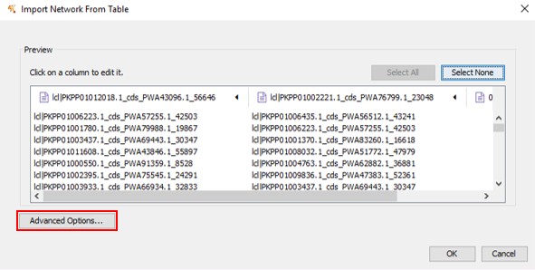
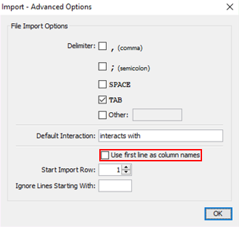
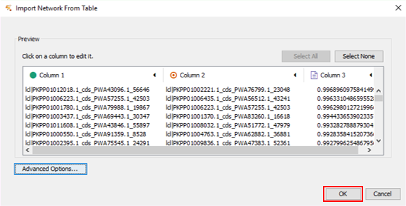

# Creating gene co-expression networks
With the trimmed expression matrix obtained from the [previous tutorial](02_qc.md), we are now ready to create gene co-expression networks based on our gene of interest. For this example, we will use the amorpha-4,11-diene synthase gene (lcl|PKPP01004763.1_cds_PWA62882.1_36881) from <i>Artemisia annua</i> as our gene of interest. 

## Running the script
  * Enter the directory where you want your co-expression networks to be generated
  * Run the [LSTrAP-Lite_PCC_cal.py](../LSTrAP-Lite_PCC_cal.py) script
  * Enter the gene of interest. Recommended parameters are used by default unless otherwise specified by user.
      * Pearson Correlation Coefficient cutoff value is set at 0.7
      * Size of gene co-expression network is set at 51 (inclusive of gene of interest)

Eg. Running with default settings 
&nbsp;&nbsp;&nbsp;&nbsp;&nbsp;&nbsp;<code>lcl|PKPP01004763.1_cds_PWA62882.1_36881</code> 
Eg. Running with PCC cutoff 0.9 and network size 20 
&nbsp;&nbsp;&nbsp;&nbsp;&nbsp;&nbsp;<code>lcl|PKPP01004763.1_cds_PWA62882.1_36881,0.9,20</code>

## Output files
  * <b>lcl_PKPP01004763.1_cds_PWA62882.1_36881_nbh.txt</b> contains the genes associated with the gene of interest
  * <b>lcl_PKPP01004763.1_cds_PWA62882.1_36881_nw.txt</b> is gene co-expression network file compatible with cytoscape

## Visualising the network
The network will be visualised with using the Cytoscape software ([download here](https://cytoscape.org/download.html)).
  1. Import a network (File>Import>Network from file)
  2. Go to "Advanced options" and uncheck the "Use first line as column names option". 
  
  
  3. Set first, second and third columns as "Source node", "Target node" and "Edge attribute" respectively and click "OK". 
  

You have now created your first network using LSTrAP-Lite!
If you have further questions or feedback, do not hesitate to [contact us](mailto:qiaowen001@e.ntu.edu.sg).
