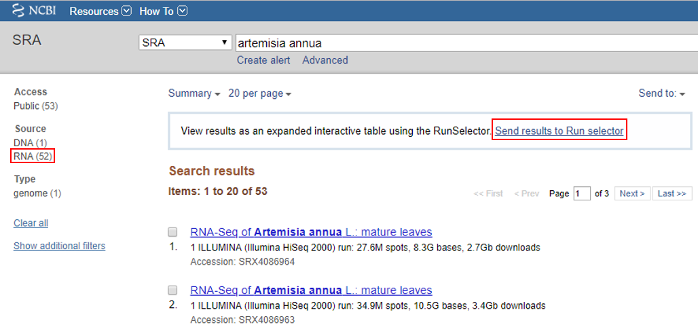
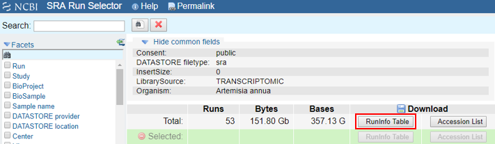
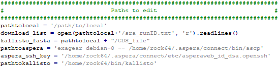

# Tutorial
Welcome to the tutorial on how to use the LSTrAP-Lite source code!
We will use the sample data provided to demonstrate where the code should be modified to build your own co-expression networks.

## Selecting the files to download
  * Go to [NCBI SRA](https://www.ncbi.nlm.nih.gov/sra)
  * Search for the files that you want to download, select only RNA sources and send results to RunSelector.   
    Eg. <i>Artemisia annua</i> 
    
  * Download the RunInfo Table
    
  * Copy the "Run" and "LibraryLayout" columns for the samples you want to download from the SraRunTable and paste it into a new file. Refer to the example [here](/sample_data/sra_runID.txt).

## Download the CDS file for the organism of interest
  * For the tutorial, we will be downloading the CDS file of <i>Artemisia annua</i> from NCBI RefSeq. Click [here](ftp://ftp.ncbi.nlm.nih.gov/genomes/all/GCA/003/112/345/GCA_003112345.1_ASM311234v1/GCA_003112345.1_ASM311234v1_cds_from_genomic.fna.gz) to download.
  * For CDS files from other sources, please refer to the [kallisto manual](https://pachterlab.github.io/kallisto/manual) for compatibility of your fasta file to build the <b>kallisto index</b> file.

## Modifying the paths

In the section "Paths to edit" found in LSTrAP-Lite_download.py, there are a few paths that needs to be modified for the script to work.
  * <b>pathtolocal</b> refers to the directory that your will be working in to download and process the files.
  * <b>download_list</b> refers to the file that contains the SRA run ID and the respective library format of the files that you want to download. Click [here](/sample_data/sra_runID.txt) for an example. These information can be found in the SRA run ta
  
